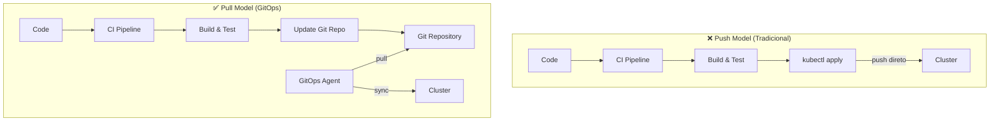
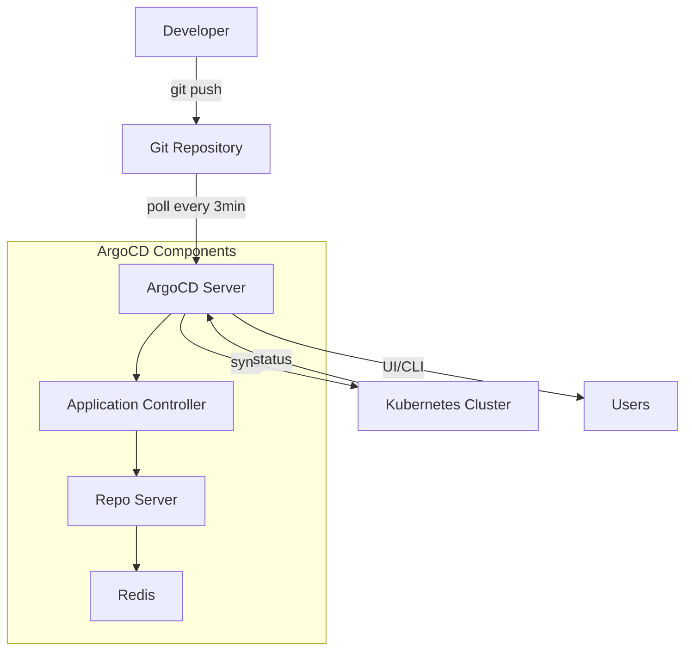
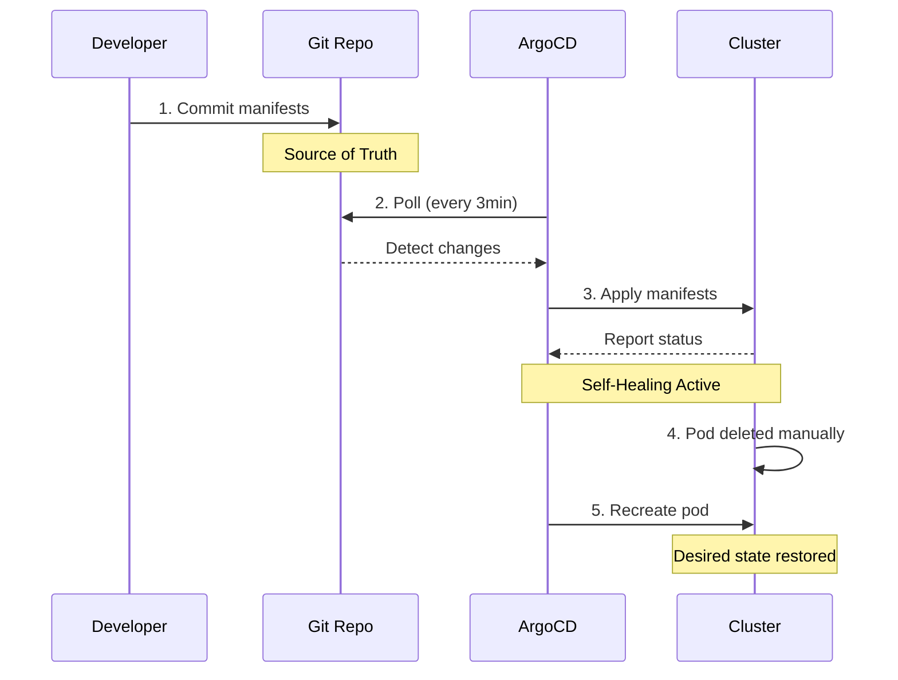

# 🎬 Vídeo 4.1 - GitOps com ArgoCD

**Aula**: 4 - GitOps  
**Vídeo**: 4.1  
**Temas**: GitOps; ArgoCD; Continuous Deployment; Sync  

---

## 📚 Parte 1: Conceito GitOps

### Passo 1: O que é GitOps?

#### CI/CD Tradicional vs GitOps



**Diferenças:**

| Aspecto | Push Model | Pull Model (GitOps) |
|---------|------------|---------------------|
| **Acesso ao Cluster** | ❌ Pipeline precisa credenciais | ✅ Agent no cluster |
| **Auditoria** | ❌ Difícil rastrear | ✅ Git history completo |
| **Estado** | ❌ Pode divergir | ✅ Git = Source of Truth |
| **Self-Healing** | ❌ Manual | ✅ Automático |
| **Segurança** | ❌ Credenciais expostas | ✅ Sem credenciais externas |

---

## ⚙️ Parte 2: Setup ArgoCD

### Passo 2: Verificar Cluster

```bash
# Verificar se cluster existe
kubectl get nodes

# Se não existir, criar cluster EKS
eksctl create cluster \
  --name fiap-gitops-cluster \
  --region us-east-1 \
  --nodegroup-name workers \
  --node-type t3.medium \
  --nodes 2
```

### Passo 3: Instalar ArgoCD

```bash
# Criar namespace
kubectl create namespace argocd

# Instalar ArgoCD
kubectl apply -n argocd -f https://raw.githubusercontent.com/argoproj/argo-cd/stable/manifests/install.yaml

# Aguardar pods ficarem prontos (2-3 min)
kubectl wait --for=condition=ready pod -l app.kubernetes.io/name=argocd-server -n argocd --timeout=300s

# Ver pods
kubectl get pods -n argocd
```

### Passo 4: Acessar ArgoCD UI

```bash
# Expor ArgoCD via port-forward
kubectl port-forward svc/argocd-server -n argocd 8080:443 &

# Obter senha inicial
ARGOCD_PASSWORD=$(kubectl -n argocd get secret argocd-initial-admin-secret -o jsonpath="{.data.password}" | base64 -d)
echo "Password: $ARGOCD_PASSWORD"

# Acessar UI
open https://localhost:8080
# Login: admin / <senha_obtida>
# Aceitar certificado self-signed
```

### Passo 5: Instalar ArgoCD CLI

```bash
# macOS
brew install argocd

# Linux
curl -sSL -o argocd-linux-amd64 https://github.com/argoproj/argo-cd/releases/latest/download/argocd-linux-amd64
sudo install -m 555 argocd-linux-amd64 /usr/local/bin/argocd
rm argocd-linux-amd64

# Verificar
argocd version
```

### Passo 6: Login via CLI

```bash
# Login
argocd login localhost:8080 \
  --username admin \
  --password $ARGOCD_PASSWORD \
  --insecure

# Mudar senha (opcional)
argocd account update-password
```

---

## 📁 Parte 3: Preparar GitOps Repository

### Passo 7: Ver Estrutura do GitOps Repo

```bash
cd ~/fiap-cicd-handson/aula-04

# Ver estrutura
tree gitops-repo/
```

**Estrutura:**
```
gitops-repo/
├── applications/
│   └── fiap-todo-api/
│       ├── base/
│       │   ├── deployment.yaml
│       │   ├── service.yaml
│       │   └── kustomization.yaml
│       └── overlays/
│           └── production/
│               ├── kustomization.yaml
│               └── deployment-patch.yaml
└── applications/
    └── fiap-todo-api-app.yaml  # ArgoCD Application
```

### Passo 8: Ver Manifests Base

```bash
# Ver deployment
cat gitops-repo/applications/fiap-todo-api/base/deployment.yaml

# Ver service
cat gitops-repo/applications/fiap-todo-api/base/service.yaml

# Ver kustomization
cat gitops-repo/applications/fiap-todo-api/base/kustomization.yaml
```

---

## 🚀 Parte 4: Deploy com ArgoCD

### Passo 9: Criar Application no ArgoCD

```bash
# Ver Application manifest
cat gitops-repo/applications/fiap-todo-api-app.yaml
```

**fiap-todo-api-app.yaml:**
```yaml
apiVersion: argoproj.io/v1alpha1
kind: Application
metadata:
  name: fiap-todo-api
  namespace: argocd
spec:
  project: default
  
  source:
    repoURL: https://github.com/SEU_USUARIO/fiap-cicd-handson
    targetRevision: main
    path: aula-04/gitops-repo/applications/fiap-todo-api/overlays/production
  
  destination:
    server: https://kubernetes.default.svc
    namespace: fiap-todo-prod
  
  syncPolicy:
    automated:
      prune: true
      selfHeal: true
    syncOptions:
      - CreateNamespace=true
```

### Passo 10: Aplicar Application

```bash
# Criar namespace para a aplicação
kubectl create namespace fiap-todo-prod

# Aplicar Application
kubectl apply -f gitops-repo/applications/fiap-todo-api-app.yaml

# Ver Application
argocd app list

# Ver detalhes
argocd app get fiap-todo-api
```

### Passo 11: Sync Manual (primeira vez)

```bash
# Sync da aplicação
argocd app sync fiap-todo-api

# Aguardar sync completar
argocd app wait fiap-todo-api --health

# Ver status
argocd app get fiap-todo-api
```

---

## 🔄 Parte 5: Testar GitOps Workflow

### Passo 12: Ver Aplicação Deployada

```bash
# Ver pods
kubectl get pods -n fiap-todo-prod

# Ver service
kubectl get service -n fiap-todo-prod

# Ver logs
kubectl logs -l app=fiap-todo-api -n fiap-todo-prod --tail=50
```

### Passo 13: Fazer Mudança no Git

```bash
cd ~/fiap-cicd-handson/aula-04

# Editar deployment (aumentar replicas)
cat > gitops-repo/applications/fiap-todo-api/overlays/production/deployment-patch.yaml << 'EOF'
apiVersion: apps/v1
kind: Deployment
metadata:
  name: fiap-todo-api
spec:
  replicas: 5  # Era 3, agora 5!
  template:
    spec:
      containers:
      - name: api
        resources:
          requests:
            memory: "256Mi"
            cpu: "200m"
          limits:
            memory: "512Mi"
            cpu: "500m"
EOF

# Commit e push
git add gitops-repo/
git commit -m "feat: aumentar replicas para 5"
git push origin main
```

### Passo 14: Ver Auto-Sync

```bash
# ArgoCD vai detectar a mudança automaticamente (3 min)
# Ver status
argocd app get fiap-todo-api

# Acompanhar sync
watch kubectl get pods -n fiap-todo-prod

# Após sync, verificar replicas
kubectl get deployment -n fiap-todo-prod
# Deve mostrar 5 replicas!
```

---

## 🔍 Parte 6: ArgoCD UI

### Passo 15: Explorar UI

**No ArgoCD UI (https://localhost:8080):**

1. **Applications** → Ver `fiap-todo-api`
2. Clicar na aplicação
3. Ver:
   - **Topology**: Visualização gráfica dos recursos
   - **Sync Status**: Synced / OutOfSync
   - **Health Status**: Healthy / Degraded
   - **Last Sync**: Timestamp da última sincronização

4. **App Details**:
   - Source: Git repo e path
   - Destination: Cluster e namespace
   - Sync Policy: Auto-sync habilitado

5. **History**:
   - Ver histórico de syncs
   - Cada commit do Git aparece aqui

### Passo 16: Testar Self-Healing

```bash
# Deletar um pod manualmente
POD=$(kubectl get pods -n fiap-todo-prod -l app=fiap-todo-api -o jsonpath='{.items[0].metadata.name}')
kubectl delete pod $POD -n fiap-todo-prod

# ArgoCD vai recriar automaticamente!
# Ver no UI: Self-healing em ação
kubectl get pods -n fiap-todo-prod -w
```

---

## 🎓 Parte 7: Conceitos Aprendidos

### Passo 17: Arquitetura ArgoCD



**Fluxo GitOps com ArgoCD:**



**Conceitos-chave:**
- ✅ **Git como source of truth** - Única fonte da verdade
- ✅ **Pull model** - Agent no cluster puxa mudanças
- ✅ **Auto-sync** - Sincronização automática (3 min)
- ✅ **Self-healing** - Recuperação automática de estado
- ✅ **Auditoria** - Git history completo
- ✅ **Rollback** - git revert para voltar versões
- ✅ **UI visual** - Interface gráfica para monitoramento

---

**FIM DO VÍDEO 4.1** ✅
